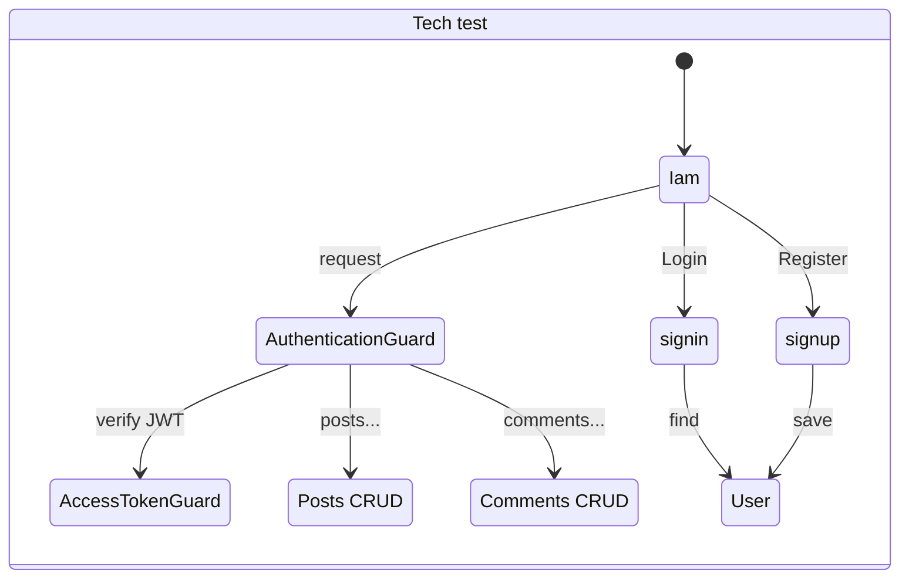

# Prueba técnica 🚀

<p align="center">
  <a href="http://nestjs.com/" target="blank"></a>
</p>

## 1 Descripción 🔥

Esta es una aplicación Backend desarrollada en Node.js utilizando TypeScript y el framework [Nest](https://github.com/nestjs/nest)💚. La aplicación cuenta con pruebas unitarias y de integración, migraciones y seeders. Además, ofrece soporte para rutas públicas y rutas protegidas mediante el uso de JWT. También incluye documentación de la API generada con Swagger.

## 2 Dependencias 

- Docker 4+
- Postgres 13+
- Nodejs 16+
- Typescript 5+

## 3 Instalación

Antes de pasar a esta sección, asegúrate de tener instalado el software de dependencias.

### 3.1 Clonar el repositorio

```bash
$ git clone git@github.com:holomdev/test_tech.git
```

### 3.2 Configurar la base de datos

El proyecto contiene un archivo llamado `docker-compose.yml`, este contiene la información para crear la base de datos para desarrollo y para pruebas e2e.
Solo es necesario correr el siguiente comando en el directorio donde clonaste la aplicación.
Por defecto la base de datos para desarrollo usa el puerto `5432` y la base de datos para pruebas e2e usa el puerto `5433`

<p align="center">
  <a href="https://www.docker.com/" target="blank"></a>
</p>

```bash
$ docker-compose up -d db-tech
```

### 3.3 Configurar las variables de entorno

A continuación, procederemos a configurar las variables de entorno del proyecto, para esto hay un archivo llamado `.env.example` en la raíz del proyecto.
Debemos hacer una copia de este archivo y renombrarla a `.env`. Después procederemos a poner la configuración correcta según las nuestras necesidades

```bash
DATABASE_USER=postgres
DATABASE_PASSWORD=pass123
DATABASE_NAME=postgres
DATABASE_PORT=5432
DATABASE_HOST=localhost

JWT_SECRET=YOUR_SECRET_KEY_HERE
JWT_TOKEN_AUDIENCE=localhost:3000
JWT_TOKEN_ISSUER=localhost:3000
JWT_ACCESS_TOKEN_TTL=3600
```

### 3.4 Instalar paquetes de la aplicación

Una vez configurada la aplicación nos disponemos a instalar los paquetes necesarios

```bash
$ npm install
```

### 3.5 Ejecutando las migraciones

#### 3.5.1 Crear migraciones
Para poder crear migraciones solo basta el siguiente comando. Esto generara un archivo dentro del directorio `src/migrations`.
```bash
$  npx typeorm migration:create src/migrations/NombreMigracion
```

#### 3.5.2 Correr migraciones existentes
Para poder correr las migraciones, antes se debe haber seteado las variables de entorno en el archivo `.env`.
Después solo basta correr los siguientes dos comandos.
```bash
$ npm run build // muy importante
$ npx typeorm migration:run -d dist/typeorm-cli.config
```

#### Ejemplo de la salida

```bash
λ npx typeorm migration:run -d dist/typeorm-cli.config
query: SELECT * FROM current_schema()
query: SELECT version();
query: SELECT * FROM "information_schema"."tables" WHERE "table_schema" = 'public' AND "table_name" = 'migrations'
query: CREATE TABLE "migrations" ("id" SERIAL NOT NULL, "timestamp" bigint NOT NULL, "name" character varying NOT NULL, CONSTRAINT "PK_8c82d7f526340ab734260ea46be" PRIMARY KEY ("id"))
query: SELECT * FROM "migrations" "migrations" ORDER BY "id" DESC
0 migrations are already loaded in the database.
3 migrations were found in the source code.
3 migrations are new migrations must be executed.
query: START TRANSACTION
query: CREATE TABLE "user"
      (
        "id" SERIAL NOT NULL,
        "name" character varying NOT NULL,
        "username" character varying NOT NULL,
...
```

### 3.6 Ejecutando los seeders jsonplaceholder.typicode
Después de haber ejecutado las migraciones para tener una estructura de tablas limpia, procedemos a llenar la base de datos de data extraída directamente de https://jsonplaceholder.typicode.com , para ellos solo es cuestión de correr los siguientes comandos.

Estos comandos ejecutaran un script que consultara la pagina web y hará las inserciones con sus relaciones.


```bash
$ npm run build
$ npm run data:sync
```

## 4 Cómo ejecutar la aplicación

### 4.1 En modo desarrollo
Nestjs ofrece dos versiones de desarrollo, pero la que comúnmente se usa es la de `"watch mode"`, ya que permite ver los cambios en vivo, si necesidad de detener y ejecutar de nuevo el servidor

```bash
# development
$ npm run start

# watch mode
$ npm run start:dev
```

### 4.2 En modo produccion
En este modo te permite correr la aplicación desde un build de producción.

```bash
# production mode
$ npm run start:prod
```

### 4.3 Crear build de produccion
Este comando nos permite solamente el build de producción en la carpeta dist para luego ser ejecutado por otro tipo de software como [PM2](https://pm2.keymetrics.io/)
```bash
# production mode
$ npm run build
```

## 5 Documentación del api

Para poder visualizar la documentación en la UI de swagger, solo es necesario correr la aplicación en modo desarrollador `npm run start:dev` para poder tener la siguiente url `http://localhost:3000/api`

<p align="center">
  <a href="https://swagger.io/" target="blank"></a>
</p>

## 6 Test

### 6.1 Test unitarios
Para correr los test unitarios solo basta el siguiente comando: 

Como dato adicional, los test unitarios, se encuentra dentro la carpeta de cada módulo y tiene una terminación con `.spec.ts` y se aplicó a controllers y services.

```bash
$ npm run test

$ npm run test:watch //modo watch
```
Ejemplo de salida

```console
λ npm run test

> test_tech@0.0.1 test
> jest

 PASS  src/posts/posts.service.spec.ts (10.393 s)
 PASS  src/comments/comments.service.spec.ts (10.416 s)
 PASS  src/iam/authentication/authentication.service.spec.ts (10.485 s)
 PASS  src/posts/posts.controller.spec.ts (11.059 s)
 PASS  src/comments/comments.controller.spec.ts (11.123 s)
 PASS  src/iam/authentication/authentication.controller.spec.ts (11.164 s)

Test Suites: 6 passed, 6 total
Tests:       45 passed, 45 total
Snapshots:   0 total
Time:        12.379 s, estimated 14 s
Ran all test suites.
```

### 6.2 Test e2e
Aunque hay varias técnicas para hacer los test e2e como puede ser mock a las funciones de la bd, o suplantar por una db tipo sqlite, en esta ocasión optamos por lanzar un base de datos en docker cada que corre un test e2e y esta misma se destruye al terminar el test para asegurar que el test es lo más real posible.

Esto se tiene automatizado en el `package.json` con los scripts `pretest` y `posttest`

Otro dato importante es que los test e2e están en `/test`

> **Warning**
> Las pruebas e2e se deben correr por separado, ya que el proceso de correrlo es pesado, a continuación, se dejan los comandos para poder hacer esto.

#### App e2e

```bash
$ npm run test:e2e -- app
```

Ejemplo de salida

```console
> test_tech@0.0.1 test:e2e
> cross-env NODE_ENV=test jest --config ./test/jest-e2e.json app

 PASS  test/app.e2e-spec.ts (19.18 s)
  AppController (e2e)
    √ /health (GET) (252 ms)

Test Suites: 1 passed, 1 total
Tests:       1 passed, 1 total
Snapshots:   0 total
Time:        19.95 s
Ran all test suites matching /app/i.
```

#### Authentication e2e
```bash
$ npm run test:e2e -- authentication
```

Ejemplo de salida

```console
> test_tech@0.0.1 test:e2e
> cross-env NODE_ENV=test jest --config ./test/jest-e2e.json authentication

 PASS  test/authentication/authentication.e2e-spec.ts (5.842 s)
  [Feature] Authentication - /authentication (e2e)
    √ sign-up [POST /]: should register user (432 ms)
    √ sign-up [POST /]: should throw an error for a duplicate email (161 ms)
    √ sign-up [POST /]: should throw an error for a bad email (5 ms)
    √ sign-up [POST /]: should throw an error for a bad password (4 ms)
    √ sign-in [POST /]: should return accessToken for correct username and password (117 ms)
    √ sign-in [POST /]: should throw an error for bad email (4 ms)
    √ sign-in [POST /]: should throw an error for non-existent user (5 ms)
    √ sign-in [POST /]: should throw an error for incorrect password (60 ms)

Test Suites: 1 passed, 1 total
Tests:       8 passed, 8 total
Snapshots:   0 total
Time:        5.973 s, estimated 7 s
Ran all test suites matching /authentication/i.
```

#### Posts e2e
```bash
$ npm run test:e2e -- posts
```

Ejemplo de salida

```console
> test_tech@0.0.1 test:e2e
> cross-env NODE_ENV=test jest --config ./test/jest-e2e.json posts

 PASS  test/posts/posts.e2e-spec.ts (6.641 s)
  [Feature] Posts - /posts (e2e)
    Authentication
      √ sign-up [POST /]: should register user (388 ms)
      √ sign-in [POST /]: should return accessToken for correct username and password (73 ms)
    Posts
      √ create [POST /]: should throw an error for unauthenticated request (5 ms)
      √ create [POST /]: should create a post (60 ms)
      √ findAll [GET /]: should throw an error for unauthenticated request (6 ms)
      √ findAll [GET /]: should return all post (10 ms)
      √ findOne [GET /:id]: should throw an error for unauthenticated request (5 ms)
      √ findOne [GET /:id]: should return a post (60 ms)
      √ findOne [GET /:id]: should throw an error for post not found (9 ms)
      √ createComment [POST /:id/comments]: should throw an error for unauthenticated request (5 ms)
      √ createComment [POST /:id/comments]: should create a comment (64 ms)
      √ createComment [POST /:id/comments]: should throw an error for post not found (8 ms)
      √ findAllComments [GET /:id/comments]: should throw an error for unauthenticated request (4 ms)
      √ findAllComments [GET /:id/comments]: should return all comments (7 ms)
      √ update [PATCH /:id]: should throw an error for unauthenticated request (3 ms)
      √ update [PATCH /:id]: should update post (66 ms)
      √ update [PATCH /:id]: should throw an error for post not found (7 ms)
      √ remove [DELETE /:id]: should throw an error for unauthenticated request (3 ms)
      √ remove [DELETE /:id]: should delete post (64 ms)
      √ remove [DELETE /:id]: should throw an error for post not found (7 ms)

Test Suites: 1 passed, 1 total
Tests:       20 passed, 20 total
Snapshots:   0 total
Time:        6.814 s, estimated 7 s
Ran all test suites matching /posts/i.
```

#### Comments e2e
```bash
$ npm run test:e2e -- comments
```

Ejemplo de salida

```console
> test_tech@0.0.1 test:e2e
> cross-env NODE_ENV=test jest --config ./test/jest-e2e.json comments

 PASS  test/comments/comments.e2e-spec.ts (7.954 s)
  [Feature] Comments - /comments (e2e)
    Authentication
      √ sign-up [POST /]: should register user (355 ms)
      √ sign-in [POST /]: should return accessToken for correct username and password (78 ms)
    Pots
      √ create [POST /]: should create a post (62 ms)
      √ createComment [POST /:id/comments]: should create a comment (14 ms)
    Comments
      √ findAll [GET /]: should return all comments (7 ms)
      √ findOne [GET /]: should return a comment (7 ms)
      √ update [PATCH /:id]: should throw an error for unauthenticated request (6 ms)
      √ update [PATCH /:id]: should update a comment (61 ms)
      √ update [PATCH /:id]: should throw an error for comment not found (7 ms)
      √ remove [DELETE /:id]: should throw an error for unauthenticated request (4 ms)
      √ remove [DELETE /:id]: should throw an error for comment not found (8 ms)
      √ remove [DELETE /:id]: should delete a comment (56 ms)

Test Suites: 1 passed, 1 total
Tests:       12 passed, 12 total
Snapshots:   0 total
Time:        8.105 s
Ran all test suites matching /comments/i.
```

## 7 Estructura del proyecto

Prácticamente nestjs usa un sistema de módulos para organizar la aplicación, en este caso tenemos varios que describiré brevemente.

### 7.1 Iam - "src/iam/"
Este modulo se encarga de lo que es la autentificación, igual la generación de tokens Jwt, registrar usuario, y se apoya de dos Guards que hacen de protección para los end points protegidos.

### 7.2 Users - "src/users/"
Este modulo solo contiene la entidad de usuarios para el ORM y se encarga de registrarlo para que este disponible a los demás módulos. 

### 7.3 Posts - "src/posts/"
Este modulo se encarga de gestionar todo lo relacionado a posts, desde las rutas de end point, los parámetros por medio de DTOS, la entidad de la base de datos y las operaciones mediante services.

### 7.4 Posts - "src/comments/"
Este modulo se encarga de gestionar todo lo relacionado a comentarios, desde las rutas de end point, los parámetros por medio de DTOS, la entidad de la base de datos y las operaciones mediante services.

### 7.5 Migrations - "src/migrations/"
Aquí se encuentran los archivos de migración, para poder darle la estructura a la base de datos.

### 7.5 Migrations - "src/seeders/"
Aquí se encuentran los scripts para poder hacer el llenado de la base de datos desde `https://jsonplaceholder.typicode.com`

